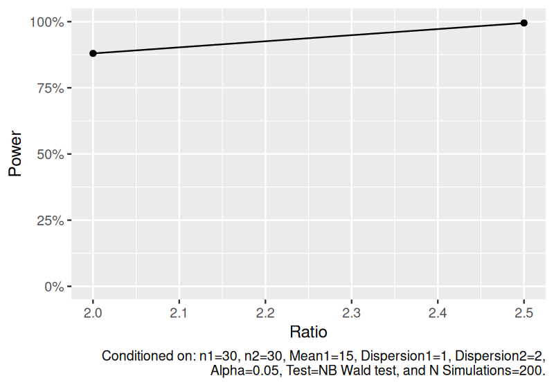
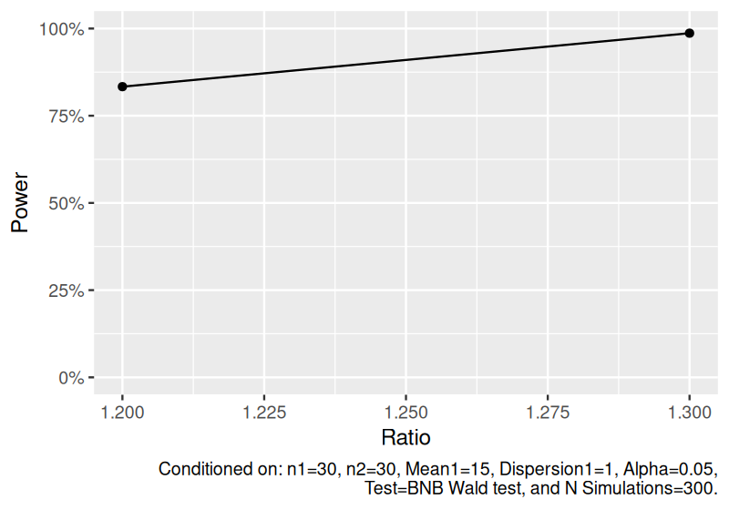
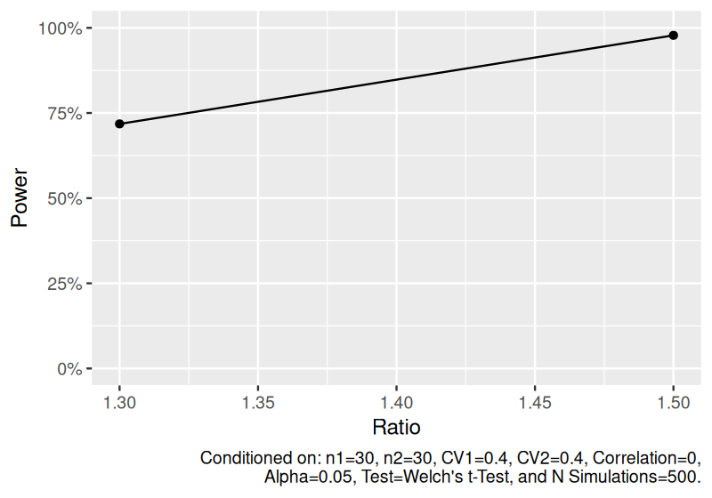
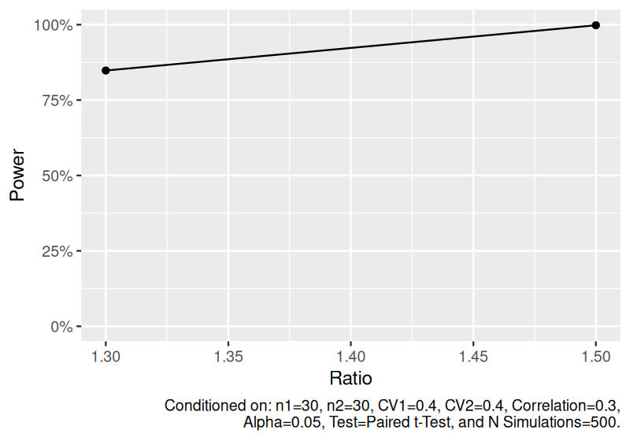
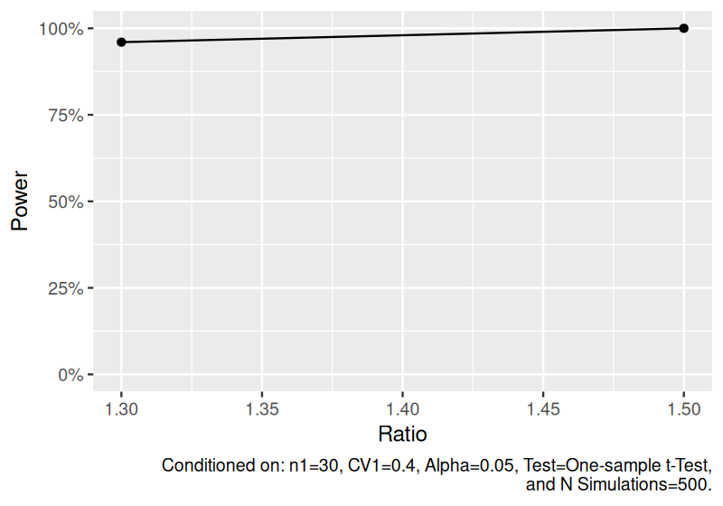

# depower

## Overview

depower provides a convenient framework to simulate, test, power, and
visualize data for differential expression studies with lognormal or
negative binomial outcomes. Supported designs are two-sample comparisons
of both independent and dependent outcomes. Power may be summarized in
the context of controlling the per-family error rate or family-wise
error rate.

## Installation

``` r
# Install from CRAN
install.packages("depower")

# Or the development version from bitbucket
remotes::install_bitbucket("bklamer/depower")
```

## Usage

``` r
library(depower)
```

Estimate power to detect the ratio of means for independent two-sample
negative binomial data.

``` r
set.seed(1234)
power_nb <- sim_nb(
  n1 = 30,
  n2 = 30,
  mean1 = 15,
  ratio = c(2, 2.5),
  dispersion1 = 1,
  dispersion2 = 2,
  nsims = 200
) |>
  power()

power_nb
#> # A tibble: 2 × 12
#>      n1    n2 mean1 mean2 ratio dispersion1 dispersion2 distribution  nsims test  alpha
#>   <dbl> <dbl> <dbl> <dbl> <dbl>       <dbl>       <dbl> <chr>         <dbl> <chr> <dbl>
#> 1    30    30    15  30     2             1           2 Independent …   200 NB W…  0.05
#> 2    30    30    15  37.5   2.5           1           2 Independent …   200 NB W…  0.05
#> # ℹ 1 more variable: power <dbl>

plot(power_nb)
```

<!-- -->

Estimate power to detect the ratio of means for bivariate negative
binomial data.

``` r
set.seed(1234)
power_bnb <- sim_bnb(
  n = 30,
  mean1 = 15,
  ratio = c(1.2, 1.3),
  dispersion = 1,
  nsims = 300
) |>
  power()

power_bnb
#> # A tibble: 2 × 11
#>      n1    n2 mean1 mean2 ratio dispersion1 distribution        nsims test  alpha power
#>   <dbl> <dbl> <dbl> <dbl> <dbl>       <dbl> <chr>               <dbl> <chr> <dbl> <dbl>
#> 1    30    30    15  18     1.2           1 Dependent two-samp…   300 BNB …  0.05 0.833
#> 2    30    30    15  19.5   1.3           1 Dependent two-samp…   300 BNB …  0.05 0.987

plot(power_bnb)
```

<!-- -->

Estimate power to detect the geometric ratio of means for independent
two-sample lognormal data.

``` r
set.seed(1234)
power_ind_lognormal <- sim_log_lognormal(
  n1 = 30,
  n2 = 30,
  ratio = c(1.3, 1.5),
  cv1 = 0.4,
  cv2 = 0.4,
  nsims = 500
) |>
  power()

power_ind_lognormal
#> # A tibble: 2 × 11
#>      n1    n2 ratio   cv1   cv2   cor distribution              nsims test  alpha power
#>   <dbl> <dbl> <dbl> <dbl> <dbl> <dbl> <chr>                     <dbl> <chr> <dbl> <dbl>
#> 1    30    30   1.3   0.4   0.4     0 Independent two-sample l…   500 Welc…  0.05 0.718
#> 2    30    30   1.5   0.4   0.4     0 Independent two-sample l…   500 Welc…  0.05 0.978

plot(power_ind_lognormal)
```

<!-- -->

Estimate power to detect the geometric mean ratio for dependent
two-sample lognormal data.

``` r
set.seed(1234)
power_dep_lognormal <- sim_log_lognormal(
  n1 = 30,
  n2 = 30,
  ratio = c(1.3, 1.5),
  cv1 = 0.4,
  cv2 = 0.4,
  cor = 0.3,
  nsims = 500
) |>
  power()

power_dep_lognormal
#> # A tibble: 2 × 11
#>      n1    n2 ratio   cv1   cv2   cor distribution              nsims test  alpha power
#>   <dbl> <dbl> <dbl> <dbl> <dbl> <dbl> <chr>                     <dbl> <chr> <dbl> <dbl>
#> 1    30    30   1.3   0.4   0.4   0.3 Dependent two-sample log…   500 Pair…  0.05 0.848
#> 2    30    30   1.5   0.4   0.4   0.3 Dependent two-sample log…   500 Pair…  0.05 0.998

plot(power_dep_lognormal)
```

<!-- -->

Estimate power to detect the geometric mean for one-sample lognormal
data.

``` r
set.seed(1234)
power_one_lognormal <- sim_log_lognormal(
  n1 = 30,
  ratio = c(1.3, 1.5),
  cv1 = 0.4,
  nsims = 500
) |>
  power()

power_one_lognormal
#> # A tibble: 2 × 8
#>      n1 ratio   cv1 distribution              nsims test              alpha power
#>   <dbl> <dbl> <dbl> <chr>                     <dbl> <chr>             <dbl> <dbl>
#> 1    30   1.3   0.4 One-sample log(lognormal)   500 One-sample t-Test  0.05  0.96
#> 2    30   1.5   0.4 One-sample log(lognormal)   500 One-sample t-Test  0.05  1

plot(power_one_lognormal)
```

<!-- -->
